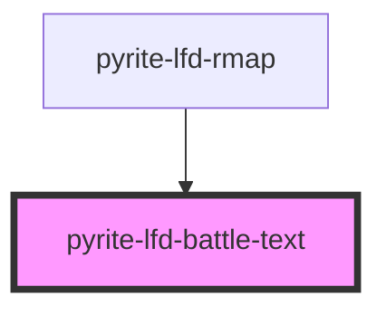

# pyrite-lfd-battle-text

<!-- Auto Generated Below -->

## Properties

| Property     | Attribute | Description | Type         | Default     |
| ------------ | --------- | ----------- | ------------ | ----------- |
| `battletext` | --        |             | `BattleText` | `undefined` |

## Dependencies

### Used by

 - [pyrite-lfd-rmap](../rmap)

### Graph

----------------------------------------------

*Built with [StencilJS](https://stenciljs.com/)*
