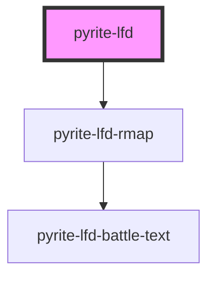

# pyrite-lfd

<!-- Auto Generated Below -->

## Properties

| Property | Attribute | Description | Type     | Default     |
| -------- | --------- | ----------- | -------- | ----------- |
| `file`   | `file`    |             | `string` | `undefined` |

## Methods

### `loadArrayBuffer(value: ArrayBuffer) => Promise<void>`

#### Returns

Type: `Promise<void>`

## Dependencies

### Depends on

- [pyrite-lfd-rmap](../rmap)

### Graph

----------------------------------------------

*Built with [StencilJS](https://stenciljs.com/)*
