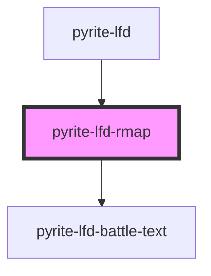

# pyrite-lfd-rmap

<!-- Auto Generated Below -->

## Properties

| Property | Attribute | Description | Type   | Default     |
| -------- | --------- | ----------- | ------ | ----------- |
| `rmap`   | --        |             | `Rmap` | `undefined` |

## Dependencies

### Used by

 - [pyrite-lfd](../lfd)

### Depends on

- [pyrite-lfd-battle-text](../battle-text)

### Graph

----------------------------------------------

*Built with [StencilJS](https://stenciljs.com/)*
