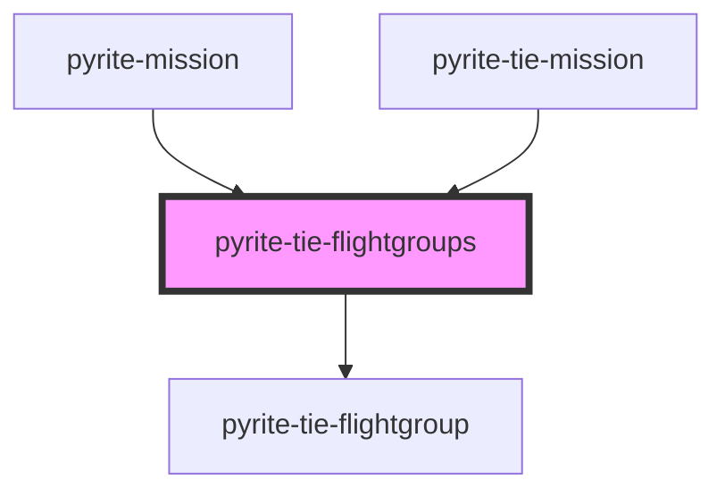

# pyrite-tie-flightgroups

<!-- Auto Generated Below -->

## Properties

| Property  | Attribute | Description | Type      | Default     |
| --------- | --------- | ----------- | --------- | ----------- |
| `mission` | --        |             | `Mission` | `undefined` |

## Dependencies

### Used by

 - [pyrite-mission](../../mission)
 - [pyrite-tie-mission](../mission)

### Depends on

- [pyrite-tie-flightgroup](.)

### Graph

----------------------------------------------

*Built with [StencilJS](https://stenciljs.com/)*
