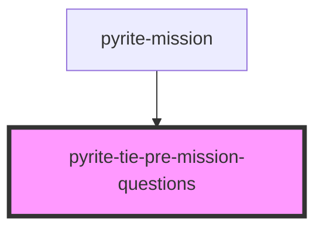

# pyrite-tie-pre-mission-questions

<!-- Auto Generated Below -->

## Properties

| Property              | Attribute | Description | Type                  | Default     |
| --------------------- | --------- | ----------- | --------------------- | ----------- |
| `premissionquestions` | --        |             | `PreMissionQuestions` | `undefined` |

## Dependencies

### Used by

 - [pyrite-mission](../../mission)

### Graph

----------------------------------------------

*Built with [StencilJS](https://stenciljs.com/)*
