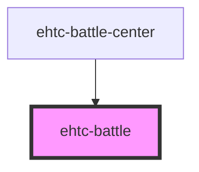

# ehtc-battle

<!-- Auto Generated Below -->

## Properties

| Property | Attribute | Description | Type     | Default     |
| -------- | --------- | ----------- | -------- | ----------- |
| `battle` | --        |             | `Battle` | `undefined` |
| `code`   | `code`    |             | `string` | `undefined` |

## Events

| Event            | Description | Type                  |
| ---------------- | ----------- | --------------------- |
| `downloadBattle` |             | `CustomEvent<Battle>` |

## Dependencies

### Used by

 - [ehtc-battle-center](../battle-center)

### Graph

----------------------------------------------

*Built with [StencilJS](https://stenciljs.com/)*
